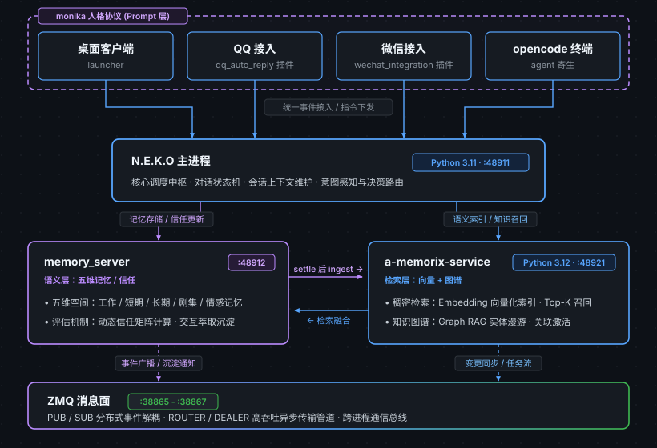

# neko-services

统一 AI 伴侣系统的集成服务仓库：以 [N.E.K.O](https://github.com/Project-N-E-K-O/N.E.K.O) 为基底，把五个上游 RP/Agentic 项目的最强模块（A_memorix 检索、monika 人格协议、MaiBot 人味管线）整合为一个跨桌面 / QQ / 微信 / opencode 的单角色统一 AI 伴侣。

## 目录结构（2026-09-22 重构：核心组件独立化）

```
core/                      # 独立核心组件（不依赖 N.E.K.O 运行时）
  memory-client/           # 统一记忆客户端（body-status 强制检查 + 端点契约表）
  persona/                 # 人格资产（六模块 / 角色卡 / OOC 回归集）
  pet-engine/              # 桌宠引擎（pixi-live2d + 行为状态机 + 慢眨眼协议）
  channels/opencode/       # opencode 终端通道（agent + 记忆工具 + 同步插件）
services/a-memorix/        # A_memorix 检索服务（vendored 树 + 注入式 shim，Python 3.12）
runtime/                   # N.E.K.O 运行时桥（过渡层，非终态）
  patches/neko/            # 对上游的 13 个补丁（format-patch 序列，可重放）
  systemd/                 # 宿主服务单元
desktop-app/               # 唯一前端（纸质配置页 + 桌宠挂载；N.E.K.O 自带 web UI 已弃用）
scripts/ docs/ deploy/     # 运维脚本 / 文档 / 角色部署产物
```

**架构方向**：核心价值（记忆契约 / 人格 / 桌宠 / 通道）在 `core/` 独立演进；
N.E.K.O 上游是记忆服务与会话管线的运行时宿主（经 `runtime/patches` 桥接），
其自带 web 前端（:48911）已弃用——唯一维护的前端是 `desktop-app/`，
对话主入口为 opencode 与 IM 通道。

## 架构



## 快速开始

待 P0-0 完成后补充（runbook 见 `README-RUNBOOK.md`，四端冒烟见 `scripts/smoke.sh`）。

## 许可

仓库整体 **AGPL-3.0**（见 LICENSE）。分区说明：

- `services/a-memorix/A_memorix/` 源自 MaiBot（AGPL-3.0，另有 MaiBot GPL 特殊授权见 `a-memorix-LICENSE-MAIBOT-GPL.md`），继承原许可
- 其余原创代码（脚本 / 接入层 / 桩）原以 Apache-2.0 授权，因仓库聚合 AGPL-3.0 生效
- `runtime/patches/neko/` 中的补丁针对 N.E.K.O（Apache-2.0）项目，补丁内容遵循其目标项目许可

## 上游与分叉姿态

默认钉死版本、被动跟进：仅 QQ 协议 / NapCat 破坏性变更时拉取上游，按 patch manifest 重放。上游基线 commit 记录在 `runtime/patches/neko/BASELINE.md`。

## 文档索引

- [工作计划](docs/workplan.md)：P0-0 → P2-3 十个工作项与里程碑
- [整合宪章](docs/integration-charter.md)：11 项产品决策
- [MVP 技术方案](docs/design/mvp-tech-design.md)：含三阶段审查记录
- [接口审计](docs/design/neko-access-audit.md)、[模块接口审计](docs/design/module-interface-audit.md)
